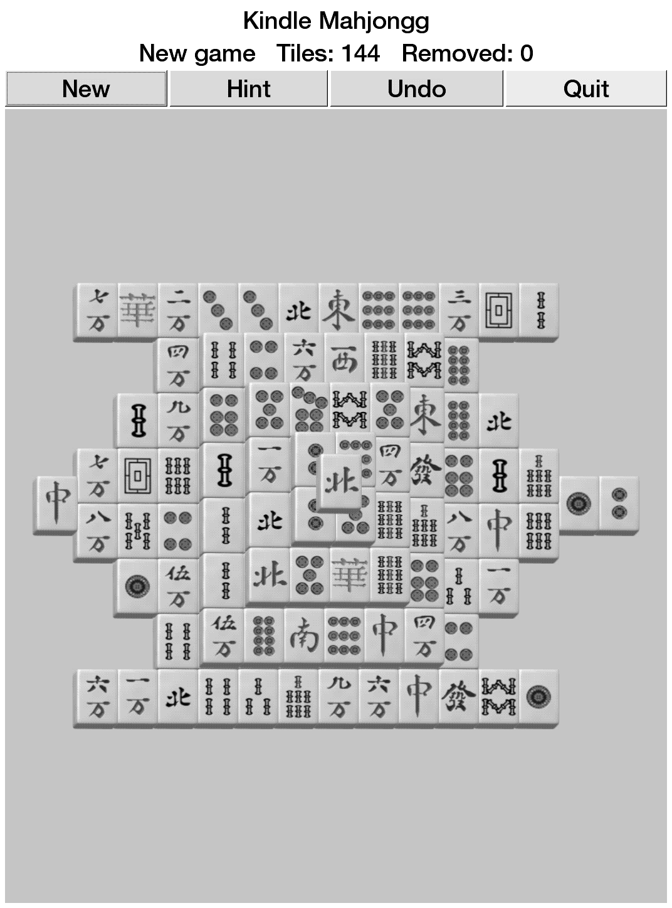

# Kindle Mahjongg

A compact Kindle-friendly Mahjongg solitaire app inspired by GNOME Games'
Mahjongg.



Kindle Mahjongg is an unofficial Kindle-focused derivative/adaptation of GNOME
Games Mahjongg. It keeps the Mahjongg solitaire concept, GNOME Games lineage,
and selected Mahjongg assets/layout inspiration, while replacing the original
GNOME desktop application shell with a small GTK2/Cairo interface packaged for
jailbroken Kindle devices.

This project is also informed by the GnomeGames4Kindle porting work and follows
the same packaging approach used by Kindle Iagno and Kindle GlChess. Original
GNOME Games / Mahjongg code, ideas, layouts, and artwork remain credited to the
GNOME Games authors; Kindle porting groundwork and packaging references are
credited to GnomeGames4Kindle and its author(s).

## Features

- Touch-friendly Mahjongg solitaire board using the GNOME Mahjongg Easy layout shape.
- GNOME Mahjongg tile artwork adapted for a grayscale e-ink display.
- Match selection, hint, undo, remaining-tile count, and move count.
- KUAL extension package with bundled ARM runtime libraries.

## Install

Use the prebuilt extension package:

```text
release/kindle-mahjongg-extension.zip
```

Unzip it at the Kindle USB-storage root so it creates:

```text
/mnt/us/extensions/kindle-mahjongg
/mnt/us/documents/shortcut_kindlemahjongg.sh
```

Then launch from KUAL:

```text
KUAL -> Kindle Mahjongg -> Launch
```

The document shortcut is optional. KUAL is the reliable launch path; a stock
Kindle home screen normally will not execute `.sh` files unless another script
launcher/file association is installed.

## Kindle Prerequisites

This is native Kindle homebrew. You need:

- A jailbroken Kindle.
- KUAL installed.
- MRPI installed if your jailbreak/KUAL setup uses MRPI for package installs.
- USB access to copy this extension to `/mnt/us`.

Useful references:

- Kindle Modding Wiki, jailbreak overview: https://kindlemodding.org/jailbreaking/
- Kindle Modding Wiki, KUAL and MRPI setup: https://kindlemodding.org/jailbreaking/post-jailbreak/installing-kual-mrpi/
- MobileRead KUAL thread: https://www.mobileread.com/forums/showthread.php?t=203326
- MobileRead MRPI wiki: https://wiki.mobileread.com/wiki/MobileRead_Package_Installer
- MobileRead Kindle 5.x jailbreak notes: https://wiki.mobileread.com/wiki/5_x_Jailbreak

Kindle jailbreak compatibility depends on model and firmware. Follow the
current guide for your exact device; do not assume a jailbreak method applies
just because another Kindle model works.

## Build

The supported build path is Docker cross/foreign-architecture build using an
ARMv7 Debian Bullseye container:

```bash
./docker_rebuild.sh
```

That command:

- Builds or starts the persistent `kindle-mahjongg-armhf-builder` container.
- Compiles the ARM hard-float `kindle-mahjongg` binary.
- Runs `smoke-test`.
- Packages `dist/kindle-mahjongg-extension.zip`.

If your Linux Docker install cannot run ARM containers, install binfmt support:

```bash
docker run --privileged --rm tonistiigi/binfmt --install arm
```

See [docs/BUILDING.md](docs/BUILDING.md) for the full build process.

## Release Artifact

The checked-in release artifact is:

```text
release/kindle-mahjongg-extension.zip
```

Verify it with:

```bash
cd release
sha256sum -c SHA256SUMS
```

## License And Provenance

Kindle Mahjongg is not an official GNOME project or an official
GnomeGames4Kindle release. It is a derivative/adaptation project that includes
assets and project lineage from GNOME Games Mahjongg and keeps the applicable
GPL-family license texts in `licenses/`. The Kindle-specific application code
in this repository is distributed under the same GPL-family terms to keep the
derivative work redistributable with its GNOME-derived material.

Runtime libraries bundled in the release zip keep their own upstream licenses;
the generated package includes `LICENSES/RUNTIME-LIBS.txt` and
`LICENSES/THIRD-PARTY-NOTICE.txt`.

See [docs/PROVENANCE.md](docs/PROVENANCE.md).

## Publishing Checklist

Before publishing a GitHub release, keep these files together:

- Source tree, including `assets/`, `licenses/`, `docs/`, and `extension/`.
- Binary package: `release/kindle-mahjongg-extension.zip`.
- Checksum file: `release/SHA256SUMS`.
- Runtime notices embedded inside the zip under `extensions/kindle-mahjongg/LICENSES/`.
